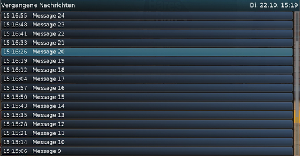
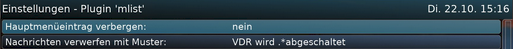

# Overview

This is a "plugin" for the Video Disk Recorder (VDR).

Originally written by:
* Joachim Wilke [vdr (at) joachim (minus) wilke (dot) de]
* Project homepage: https://github.com/jowi24/vdr-mlist
* Latest version available at: https://github.com/jowi24/vdr-mlist/releases

This is a community-maintained fork of the above plugin,
as the plugin has not been taken care of for years.

* Project fork: https://github.com/vdr-projects/vdr-plugin-mlist
* Contributors: Stefan Hofmann (StHofmann)

See the file COPYING for license information.

---

# Description

The plugin displays a list of OSD-Messages shown since VDR start-up.
To avoid flooding the history with periodic messages, like shutdown
announcements, messages matching a user-defined pattern (regular
expression) can be excluded from being recorded in the history.

# Screenshots

# Note to Translators

If you translate this plugin to your language, please do so in creating 
a _language.po_ file from the _*.pot_ template file located in the _po/_ 
sub-directory after compiling the plugin. 